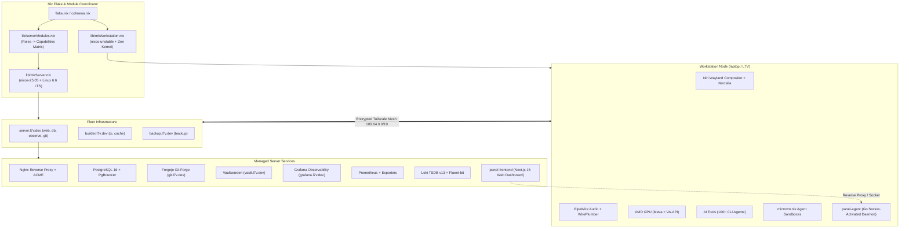

# System Architecture & Infrastructure Design

> **Scope:** Multi-Host NixOS Platform, Capability Model, and Control Center Architecture

---

## 🏛️ Top-Level Architecture Diagram



---

## 🏗️ Architectural Principles

### 1. Capability-First Modular Design
Rather than monolithically coupling service declarations to hostnames, all features are organized as **Cross-Cutting Capabilities** (`modules/capabilities/`). Server hosts declare abstract roles (`web`, `db`, `ci`, `observe`), and `lib/serverModules.nix` maps those roles into concrete capabilities:

```text
Role 'web'     ──> secrets + reverse-proxy + metrics + logging
Role 'db'      ──> secrets + database + metrics + logging + backup
Role 'observe' ──> secrets + metrics + logging
Role 'git'     ──> secrets + reverse-proxy + database + backup
Role 'ci'      ──> secrets + metrics + logging
Role 'cache'   ──> secrets + cache
Role 'backup'  ──> secrets + backup
```

### 2. Strict Channel Segregation
- **Workstation (`L7V`):** Tracks `nixos-unstable` for cutting-edge Wayland improvements, graphics drivers, developer runtimes, and fast-moving AI tools.
- **Servers (`server`, `builder`, `backup`):** Pin `nixos-25.05` LTS with Linux 6.6 LTS kernel for mission-critical stability, reproducible long-term security backports, and deterministic builds.

### 3. Layered Module Hierarchy

```text
modules/
├── capabilities/    # Infrastructure building blocks (secrets, database, metrics, logging, proxy, backup, cache, mesh)
├── experience/      # Desktop experience (Niri, Noctalia, Hyprland, greeter, audio, screencast, power)
├── infrastructure/  # Low-level OS platform (boot, identity, network, security, storage)
├── platform/        # Developer & operational platform (ci, deploy, documentation, fhs, inventory, recovery)
└── services/        # User-facing application suites (forgejo, grafana, vaultwarden, attic, panel)
```

---

## 🔒 Security Architecture

1. **At-Rest Encryption:** All sensitive tokens (DB passwords, admin tokens, signing keys) are encrypted via SOPS with Age keys (`/etc/age/key`).
2. **Runtime Secret Delivery:** Secrets are decrypted to tmpfs memory (`/run/secrets/`) during system activation.
3. **Privilege Separation:** Applications authenticate via local Unix domain sockets or loopback listeners (`127.0.0.1`). Services never run as root unless required for kernel interactions.
4. **Network Hardening:** SSH password authentication is disabled; fail2ban monitors brute-force attempts on servers; sysctl filters invalid IP packets and source routing.
