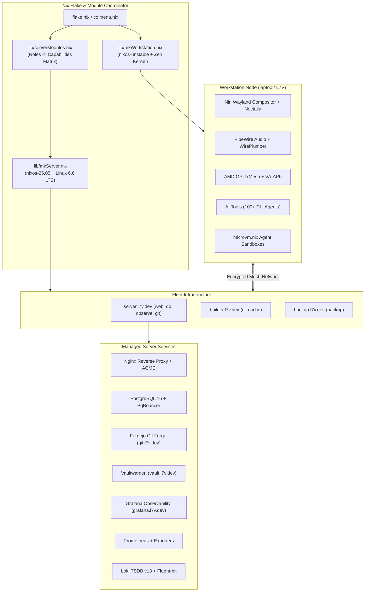
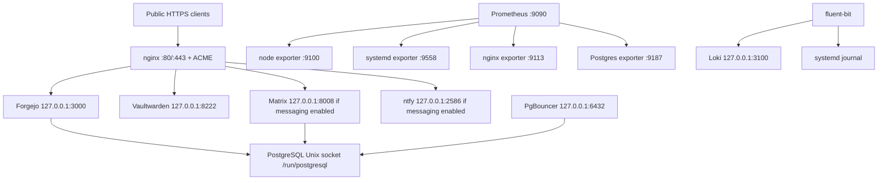

# System Architecture & Infrastructure Design

> **Scope:** Multi-Host NixOS Platform and Capability Model Architecture

---

## 🏛️ Top-Level Architecture Diagram



---

## 🏗️ Architectural Principles

### 1. Capability-First Modular Design
Rather than monolithically coupling service declarations to hostnames, all features are organized as **Cross-Cutting Capabilities** (`modules/capabilities/`). Server hosts declare abstract roles (`web`, `db`, `ci`, `observe`), and `lib/serverModules.nix` maps those roles into concrete capabilities:

```text
Role 'web'     ──> secrets + reverse-proxy + metrics + logging
Role 'db'      ──> secrets + database + metrics + logging + backup
Role 'observe' ──> secrets + metrics + logging
Role 'git'     ──> secrets + reverse-proxy + database + backup
Role 'ci'      ──> secrets + metrics + logging
Role 'cache'   ──> secrets + cache
Role 'backup'  ──> secrets + backup
```

### 2. Strict Channel Segregation
- **Workstation (`L7V`):** Tracks `nixos-unstable` for cutting-edge Wayland improvements, graphics drivers, developer runtimes, and fast-moving AI tools.
- **Servers (`server`, `builder`, `backup`):** Pin `nixos-25.05` LTS with Linux 6.6 LTS kernel for mission-critical stability, reproducible long-term security backports, and deterministic builds.

### 3. Layered Module Hierarchy

```text
modules/
├── capabilities/    # Infrastructure building blocks (secrets, database, metrics, logging, proxy, backup, cache, mesh)
├── experience/      # Desktop experience (Niri, Noctalia, Hyprland, greeter, audio, screencast, power)
├── infrastructure/  # Low-level OS platform (boot, identity, network, security, storage)
├── platform/        # Developer & operational platform (ci, deploy, documentation, fhs, inventory, recovery)
└── services/        # User-facing application suites (forgejo, grafana, vaultwarden, attic)
```

---

## 🔄 Service-to-Service Communication & Data Flow

İletişim ağırlıklı olarak aynı host üzerindeki loopback (`127.0.0.1`) veya Unix domain socket üzerinden gerçekleşir:



### Data Flow Pattern
Bir kullanıcı isteğinde veri akışı `Public DNS` → `nginx ACME/TLS` → `loopback uygulama listener'ı` şeklindedir.
- Uygulama state'i PostgreSQL veya SQLite üzerinde tutulur.
- Host metrics Prometheus exporter'larından 15 saniyelik scrape ile Prometheus TSDB'ye yazılır.
- Journal girdileri fluent-bit tarafından Loki'ye gönderilir.
- Restic, seçili filesystem yollarını günlük timer ile S3 veya SFTP repository'sine şifreli snapshot olarak aktarır.

---

## 🔒 Security & Authentication Architecture

| Alan | Uygulama / Politika |
|---|---|
| Host SSH | Sunucularda password authentication ve keyboard-interactive kapalıdır; root login yalnızca public key ile `prohibit-password` şeklinde ayarlanır. Workstation'da inbound SSH varsayılan olarak kapalıdır. |
| Colmena | `targetUser = "root"`; client SSH config hedef hostlarda `~/.ssh/id_ed25519` kullanır. |
| NixOS kullanıcı | Primary user varsayılan olarak `l7v`; `wheel`, `networkmanager`, `docker`, `kvm` gruplarına eklenir. Primary user için sudo NOPASSWD tanımı bulunur. |
| SOPS / Age | All sensitive tokens (DB passwords, admin tokens, signing keys) are encrypted via SOPS with Age keys (`/etc/age/key`). Decrypted to tmpfs memory (`/run/secrets/`) during system activation. |
| Forgejo | Registration kapalı, sign-in view açık; admin password SOPS secret üzerinden sağlanır. |
| Vaultwarden | Admin token SOPS'tan `/run/vaultwarden-env` içine yazılır; public signup varsayılan olarak kapalıdır. |
| PgBouncer | MD5 userlist secret; port `6432`, loopback bind, session pooling. |

---

## 🔌 External Integrations Matrix

| Entegrasyon | Kullanım Amacı | Konfigürasyon Kaynağı |
|---|---|---|
| `nixpkgs`, `nixpkgs-stable` | Workstation / server paket setleri | `flake.nix`, `flake.lock` |
| Home Manager | User profile deployment | `mkWorkstation`, `serverModules` |
| SOPS-nix / age | Secret dağıtımı | `modules/capabilities/secrets`, `secrets/sops` |
| Niri / Noctalia | Desktop session | Flake input'ları ve experience modülleri |
| Colmena | Remote NixOS deployment | `colmena.nix` |
| ACME / Let's Encrypt | nginx public virtual host TLS | `reverse-proxy` ve service modülleri |
| S3 veya SFTP | Restic off-site repository | `capabilities/backup` |
| Forgejo Actions | CI runner registration | `platform/ci` |
| `llm-agents.nix` | AI CLI paketleri | `home/profiles/ai-tools.nix` |

---

## ⚡ Scalability & System Bottlenecks

### Scalability Approach
Mevcut yapı **tek veya az sayıda x86_64 hostlu filo** için uygundur. Yeni bir server eklemek için `flake.nix` içindeki `servers` topology'sine host, targetHost, roles ve tags eklenmesi; host/hardware dosyalarının sağlanması yeterlidir.

### Potential Bottlenecks & Risks

| Risk | Etki / Açıklama |
|---|---|
| Single PostgreSQL & Prometheus/Loki node | Host kaybında state/observability kesintisi; HA yapısı henüz kurulmamıştır. |
| Loki filesystem storage (replication factor 1) | Log dayanıklılığı ve kapasitesi tek diske bağlıdır. |
| Multi-service single server host | Reverse proxy, Forgejo, Vaultwarden ve database aynı host üzerindedir. |
| Local nix-serve on builder | Binary cache erişilebilirliği builder düğümüne bağlıdır. |
| Hardware UUID placeholders | Server, builder ve backup hardware konfigürasyonlarında gerçek disk UUID'leri set edilmelidir. |
| SOPS recipient placeholders | Server secret dağıtımı için production age public key'leri eklenmelidir. |
