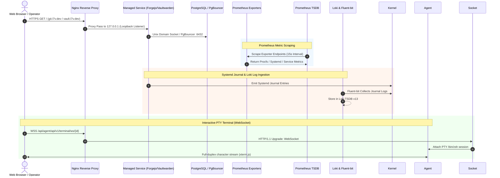
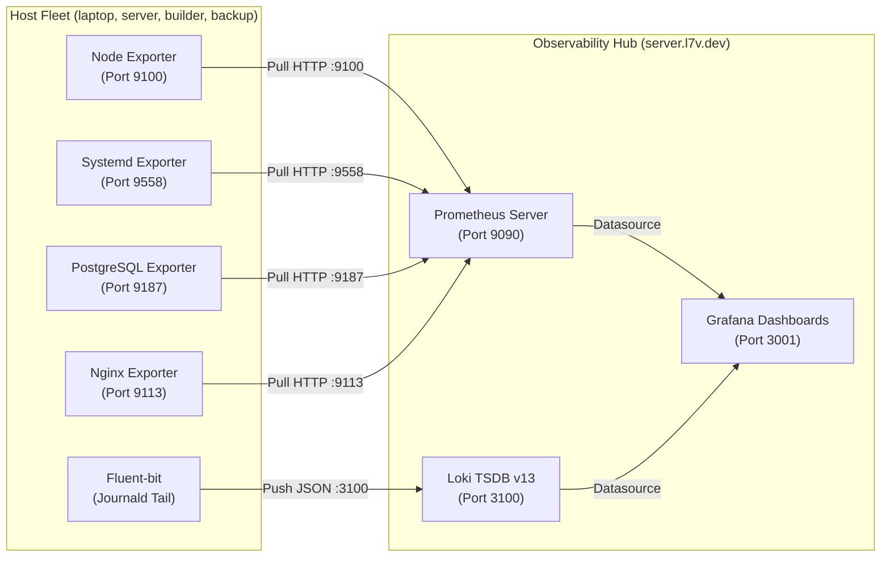
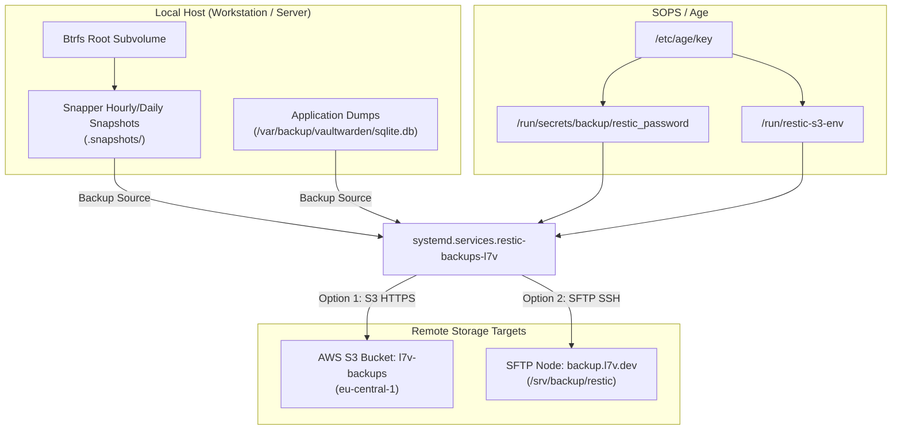

# Data Flow & Communication Channels

> **Scope:** Inter-Process Communication (IPC), D-Bus, Unix Domain Sockets, HTTP/SSE, WebSockets, Metric Pipelines, and Offsite Sync.

---

## 🔄 Core Data Flow Diagrams

### 1. Panel Agent & Web Dashboard Lifecycle

---

### 2. Observability & Telemetry Pipeline

---

### 3. Backup & Disaster Recovery Flow

