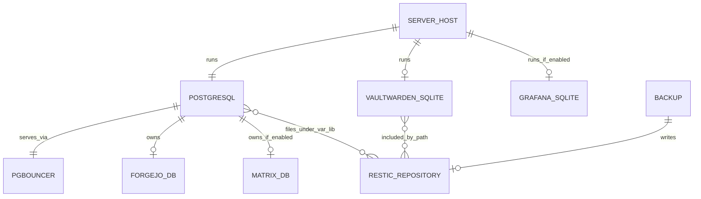

# Database

## Kapsam ve Genel Sonuç

Repository, kendi uygulama tablolarını veya SQL migration dosyalarını tanımlayan bir uygulama projesi değildir. Database katmanı NixOS servis modülleri tarafından provision edilir. Bu nedenle repository'den **tablo/kolon/index/constraint seviyesinde eksiksiz bir schema çıkarılamaz**; Forgejo, Matrix Synapse, Grafana ve Vaultwarden kendi upstream schema/migration mekanizmalarını kullanır. [1] [2]

## Database Teknolojileri

| Teknoloji | Sürüm/politika | Host kapsamı | Kodda kullanım |
|---|---|---|---|
| PostgreSQL | `postgresql_16` | `server`; laptopta local development için | Forgejo için aktif; Matrix için yalnızca messaging etkinse; genel PostgreSQL service capability ile açılır. |
| PgBouncer | NixOS paketinin lockfile'daki sürümü | `server` database capability | Loopback `127.0.0.1:6432`, `session` pooling, MD5 userlist. |
| Redis | NixOS paket seti | `L7V` laptop | `redis.servers."".enable = true`; server role mapping ile etkinleştirilmez. |
| SQLite | Servis içi | Kodda Vaultwarden; Grafana modülünde de SQLite ayarı | Vaultwarden için `/var/backup/vaultwarden` backupDir tanımı; Grafana için modül etkinleşirse internal state. |
| Prometheus TSDB | Prometheus service | Metrics etkin hostlar | 30 günlük retention, port `9090`. |
| Loki TSDB | Loki schema `v13`/TSDB | Logging etkin hostlar | Filesystem storage `/var/lib/loki`, port `3100`, replication factor `1`. |

## PostgreSQL Yapılandırması

`modules/capabilities/database/default.nix` etkin olduğunda PostgreSQL 16 aşağıdaki şekilde tanımlanır:

| Ayar | Değer |
|---|---|
| Listen address | `127.0.0.1` |
| Maximum connections | `200` |
| Shared buffers | `256MB` |
| PostgreSQL socket | `/run/postgresql` |
| PgBouncer listen address | `127.0.0.1` |
| PgBouncer port | `6432` |
| Pool mode | `session` |
| Maximum client connections | `200` |
| Default pool size | `20` |
| Auth type | `md5` |
| Auth file | SOPS-nix tarafından provision edilen `database/pgbouncer_userlist` |

Database module yalnızca `l7v.database.enable = true` ve `l7v.secrets.enable = true` olduğunda config üretir. PgBouncer tüm database adlarını PostgreSQL Unix socket'ine yönlendiren `* = host=/run/postgresql` mapping'i kullanır. [1]

## Database'ler ve Sahiplik

| Database | Kullanıcı | Oluşturulduğu yer | Durum |
|---|---|---|---|
| `forgejo` | `forgejo` | `modules/services/forgejo/default.nix` içindeki `ensureDatabases`/`ensureUsers` | `server` hostunda Forgejo enable olduğu için beklenen aktif database. |
| `matrix-synapse` | `matrix-synapse` | `modules/capabilities/messaging/default.nix` | Messaging ve Matrix ayrıca enable edilirse oluşur; mevcut hostlarda messaging enable değildir. |
| Grafana internal DB | Grafana service user | `modules/services/grafana/default.nix` | Grafana module mevcut fakat aktif hostlarda enable flag'i yoktur. |
| Vaultwarden SQLite | `vaultwarden` service | `modules/services/vaultwarden/default.nix` | `server` hostunda etkin; repository seviyesinde tablo schema'sı yoktur. |
| Local PostgreSQL databases | NixOS local PostgreSQL service | `hosts/laptop/default.nix` | Laptopta PostgreSQL 16 aktif; application database creation tanımı yoktur. |

## Tables, Columns, Keys ve Indexes

Mevcut repository'de aşağıdaki database schema artefact'ları bulunmamaktadır:

| Artefact | Repository durumu |
|---|---|
| SQL migration dosyası | Yok. |
| `CREATE TABLE`/`ALTER TABLE` sorguları | Yok. |
| Uygulama modeli/ORM schema'sı | Yok. |
| Primary key/foreign key/index tanımı | Repository'de yok; service-owned schema'lara aittir. |
| Seed data | Yok. |
| Repository-owned constraints | Yok. |

Forgejo'nun `forgejo`, Matrix'in `matrix-synapse` database provisioning'i NixOS service options seviyesinde yapılır; gerçek tablolar servisin ilk çalıştırması veya kendi migration aşaması sırasında oluşturulur. Bu servislerin runtime migration çıktısı bu checkout'tan doğrulanamaz. [2] [3]

## ER Diagram

Aşağıdaki diyagram repository'nin **provision ettiği ilişkileri** gösterir; service-owned tabloları göstermez.



## Connection Patterns

Forgejo, aktif configuration'da PostgreSQL'e `/run/postgresql` Unix socket'i üzerinden bağlanır ve NixOS service user'ı ile database ownership kullanır. PgBouncer ayrı bir loopback listener olarak provision edilir; Forgejo configuration'ında PgBouncer portuna yönlendirme bulunmadığından, repository'de Forgejo'nun PgBouncer üzerinden çalıştığı iddia edilmemelidir. [2]

Matrix configuration'ı etkinleştirilirse socket path `/run/postgresql`, database ve user `matrix-synapse` olacak şekilde tanımlanır. Laptop PostgreSQL ve Redis servisleri local development amaçlıdır; dışarıdan erişim için bir public bind tanımı yoktur. [4]

## Önemli Tanı Komutları ve Sorguları

Repository'de uygulamaya ait önemli SQL sorguları yoktur. Aşağıdaki komutlar yalnızca host üzerinde genel tanı için örnektir ve secret içermez:

```bash
# PostgreSQL database/user listesini görmek
sudo -u postgres psql -d postgres -c '\l'
sudo -u postgres psql -d postgres -c '\du'

# PostgreSQL runtime ayarlarını görmek
sudo -u postgres psql -d postgres -c 'SHOW listen_addresses;'
sudo -u postgres psql -d postgres -c 'SHOW max_connections;'

# PgBouncer servis ve port durumunu görmek
systemctl status pgbouncer.service
ss -ltnp | grep -E ':5432|:6432'

# Local Redis durumunu görmek (laptop)
systemctl status redis.service
redis-cli ping
```

`database/pgbouncer_userlist` içeriği kullanıcı/hash içerdiğinden stdout'a veya handover belgesine yazılmamalıdır.

## Migration Sistemi

Repository'nin migration sistemi **NixOS module evaluation + systemd service activation** seviyesindedir. Nix flake değişikliği configuration generation üretir; bu, repository-owned SQL migration çalıştırdığı anlamına gelmez. Forgejo, Matrix, Grafana ve Vaultwarden'ın schema migration davranışı upstream servis paketlerine bırakılmıştır. CI veya deployment öncesi otomatik migration smoke test'i bu repository'de tanımlı değildir.

## Seed Data

Seed data, fixture veya demo kullanıcı/database kaydı tanımlanmamıştır. Forgejo registration kapalıdır; admin password SOPS secret'ından gelir. Vaultwarden public signup varsayılan olarak kapalıdır. [2] [5]

## Backup ve Restore

Backup capability restic'i günlük timer ile aşağıdaki yollar için çalıştırır:

```text
/var/lib
/var/backup
/etc
/home
```

Repository backend olarak `s3` veya `sftp` seçebilir. S3 için AWS credentials `/run/restic-s3-env` içine activation sırasında yazılır; restic password SOPS secret path'inden okunur. Retention policy `7` daily, `4` weekly ve `6` monthly snapshot'tır. [6]

Vaultwarden module `backupDir = /var/backup/vaultwarden` tanımlar; bu directory'nin restic'in `/var/backup` path kapsamına girmesi amaçlanmıştır. Ancak repository'de PostgreSQL için ayrı `pg_dump` timer/service'i bulunmamaktadır. PostgreSQL physical state'i `/var/lib` kapsamına girse de **consistent logical dump, point-in-time recovery veya restore test'i garanti edilmez**. Bu durum production database recovery için ayrıca ele alınmalıdır.

Local Btrfs snapshot'ları `platform.recovery` etkin hostlarda Snapper ile `root` subvolume üzerinde tutulur. Snapper ve restic farklı koruma katmanlarıdır; Snapper off-site backup yerine geçmez. [7]

## Bilinen Schema/Secret Tutarsızlığı

Şifreli `secrets/sops/secrets.yaml` dosyasının key adları arasında `database/postgres_password` bulunmaktadır. Buna karşılık database module PgBouncer için `database/pgbouncer_userlist` secret'ını declare eder. Bu, secret dosyası veya module güncellenmeden PgBouncer authentication'ın beklenen biçimde çalışmayabileceği anlamına gelir. Secret değerleri okunmamalı; yalnızca key adı tutarlılığı düzeltilmelidir. [1] [8]

## Kaynaklar

[1]: ./modules/capabilities/database/default.nix "PostgreSQL and PgBouncer configuration"
[2]: ./modules/services/forgejo/default.nix "Forgejo database provisioning and socket connection"
[3]: ./modules/capabilities/messaging/default.nix "Conditional Matrix database provisioning"
[4]: ./hosts/laptop/default.nix "Laptop PostgreSQL and Redis services"
[5]: ./modules/services/vaultwarden/default.nix "Vaultwarden SQLite/backup settings"
[6]: ./modules/capabilities/backup/default.nix "Restic paths, schedule and retention"
[7]: ./modules/platform/recovery/default.nix "Snapper and recovery-check configuration"
[8]: ./secrets/sops/secrets.yaml "Encrypted secret key names only"

