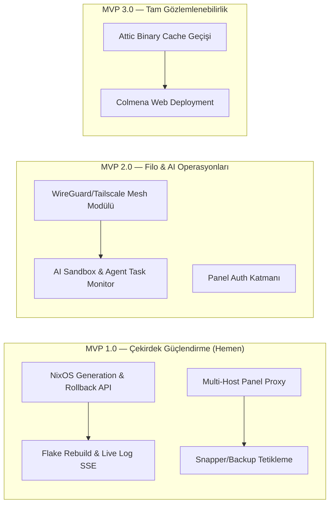

# 🚀 L7V NixOS Platform — Mimari İnceleme & MVP Yol Haritası

> [!NOTE]
> Bu doküman; L7V NixOS altyapısı, modüler sistem mimarisi, AI geliştirici sandbox'ları ve Web Kontrol Paneli (`panel/`) için mimari incelemeyi, tespit edilen eksikleri ve adım adım MVP yol haritasını içerir.

---

## 🏗️ 1. Proje Genel Mimarisi & Kapsamı

Proje; bağımsız bir NixOS dotfiles reposunun ötesinde, **bildirimsel (declarative) çok makineli sunucu filosu**, **Wayland/Niri tabanlı iş istasyonu**, **AI kodlama sandbox'ları** ve **özel bir Web Kontrol Merkezi (Go Agent + Next.js)** içeren bütüncül bir platformdur.

```text
/home/l7v/dev/projects/company/active/nixos/
├── flake.nix                         # Çoklu host tanımları (laptop, server, builder, backup)
├── hosts/                            # Host konfigürasyonları ve donanım tanımları
├── modules/                          # 5 Katmanlı NixOS modülleri
│   ├── capabilities/                 # database, backup, logging, metrics, reverse-proxy, secrets, virtualisation
│   ├── services/                     # forgejo, grafana, vaultwarden, attic (stub)
│   ├── infrastructure/               # boot, identity, network, security, storage
│   ├── platform/                     # ci, deploy, documentation, inventory, recovery
│   └── experience/                   # desktop (niri, noctalia), capabilities (audio, power...)
├── home/                             # Home-Manager profilleri & AI araçları (ai-tools.nix)
├── scripts/                          # Otomasyon, şablon (AFT/BPT) ve AI döngü araçları (claude-autonomous.sh)
└── panel/                            # l7v-panel Kontrol Merkezi
    ├── apps/agent/                   # Go Backend (systemd socket-activated REST/SSE API)
    ├── apps/web/                     # Next.js 15/16 + Tailwind + Radix UI Frontend
    └── nix/                          # gomod2nix + fetchPnpmDeps Nix paketleme ve servis modülleri
```

---

## 🔍 2. İncelenen Bileşenler & Güçlü Yönler

1. **İleri Düzey NixOS Modülerliği:**
   - Rol ve yetenek eşlemesi (`lib/serverModules.nix`, `colmena.nix`) ile DRY prensibi korunmuştur.
   - Hassas veriler SOPS + Age (`/etc/age/key`) ile bildirimsel olarak şifrelenmiştir.
2. **Kapsamlı AI & Geliştirici Ekosistemi:**
   - `llm-agents.nix` üzerinden Numtide önbelleğiyle gelen CLI araçları (`claude-code`, `aider`, `gemini-cli`, `codex`, `opencode`, `goose`, `kiro`).
   - Çok katmanlı sandbox yaklaşımı (Tier 1: `claudebox`, Tier 2: `microvm`, Tier 3: `claude-autonomous.sh` git worktree).
3. **Panel Mimarisi (`panel/`):**
   - **Go Agent (`apps/agent`):** Docker/Podman container lifecycle, journald log akışı (SSE), PTY terminal (WebSocket), systemd servis yönetimi, donanım/ses/güç kontrolü.
   - **Web UI (`apps/web`):** Modern koyu tema, responsive cockpit, container drawer, logs histogram, interaktif terminal paneli.

---

## ⚠️ 3. Tespit Edilen Eksikler ve "Olması Gereken" Özellikler

### A. NixOS Sistem Flake & Generation Yönetimi *(Kritik)*
* **Mevcut Durum:** Go agent'taki `internal/nixos/nixos.go` şu an sadece aktif jenerasyon numarasını okuyor ve `nix-collect-garbage` / `nix-store --optimise` çalıştırıyor.
* **Gereksinimler:**
  1. **Generation Listesi & Diff:** Sistemde bulunan tüm NixOS jenerasyonlarının listelenmesi (`/nix/var/nix/profiles/system*`), hangi jenerasyonda ne zaman switch yapıldığı ve paket farkları.
  2. **Web Üzerinden Rollback & Switch:** Panel üzerinden tek tıkla eski jenerasyona rollback yapabilme veya `nh os switch` / `nixos-rebuild switch` tetikleme.
  3. **Rebuild & Update Log Akışı:** `update.sh` veya rebuild komut çıktısının web terminaline / SSE log kanalına canlı akıtılması.
  4. **Flake Inputs & Lock Sağlığı:** `flake.lock` içindeki girdilerin güncellik durumu ve diff görünümü.

### B. Multi-Host Filo Yönetimi & Mesh Ağı (Fleet Orchestration)
* **Mevcut Durum:** Panel frontend'i tek bir agent socket'ine (`AGENT_BASE_URL`) bağlı. Sunucu filosu (`server`, `builder`, `backup`) Colmena üzerinden tanımlı ancak Web panelinden izole.
* **Gereksinimler:**
  1. **Panel Çoklu Host Seçici:** Panel üst barında `Laptop`, `Server`, `Builder`, `Backup` arasında anında geçiş yaparak ilgili makinenin agent'ına istek yönlendirme (`panelCfg.agent.managedHosts` üzerinden).
  2. **Bildirimsel Mesh VPN (Tailscale / WireGuard):** Düğümler (`laptop`, `server`, `builder`, `backup`) arasında public port açmadan güvenli haberleşme sağlayan `l7v.capabilities.mesh` modülü.
  3. **Colmena Deployment Tetikleyici:** Panel üzerinden veya tek CLI komutuyla tüm filoya deployment yayınlama ve durum takibi.

### C. Btrfs Snapshot & Restic Yedekleme Kontrol Merkezi
* **Mevcut Durum:** `modules/platform/recovery/default.nix` ve `modules/capabilities/backup/default.nix` systemd timer'ları ile arka planda çalışıyor.
* **Gereksinimler:**
  1. **Btrfs Snapper Snapshot Arayüzü:** Sistem değişikliği öncesi panelden anlık snapshot alma (`snapper create -d "Pre-switch"`), snapshot listesini görme ve geri yükleme.
  2. **Restic Yedekleme Paneli:** Son başarılı yedekleme zamanı, snapshot boyutları, depolama alanı ve "Şimdi Yedekle" butonu.

### D. AI Agent & Sandbox Yönetim Merkezi (Agent Hub)
* **Mevcut Durum:** AI scriptleri (`claude-autonomous.sh`, `claudebox`) CLI üzerinden tmux oturumlarında çalışıyor.
* **Gereksinimler:**
  1. **Aktif Agent Görev İzleyicisi:** Arka planda veya worktree'de çalışan otonom agent görevlerinin durumu, CPU/bellek kullanımı ve terminal log çıktısı.
  2. **MicroVM Ephemeral Runner:** Tier 2 seviyesinde izole bir sanal makinede tek tıkla agent ayağa kaldırma (`microvm.host`).

### E. Güvenlik, SOPS & Web Kimlik Doğrulama
* **Mevcut Durum:** Panel sadece yerel soket / IP allowlist (`allowedCIDRs`) ile korunuyor.
* **Gereksinimler:**
  1. **Panel Web Auth (Session / PAM / PIN):** Web arayüzüne giriş için hafif bir kimlik doğrulama katmanı.
  2. **Güvenlik Durumu & Port Denetimi:** Açık dinlenen portlar (`ss -tulpn`), fail2ban ban listesi ve SOPS age anahtarı doğrulama kartı.

---

## 🗺️ 4. MVP Yol Haritası (3 Fazlı)



---

## 🎯 5. MVP 1.0 Detaylı Görev Listesi (Core MVP)

### 1. NixOS Flake & Jenerasyon Yönetimi
- [x] **Agent Backend:** `internal/nixos/generations.go`, `diff.go`, `flake.go`, `rebuild.go`
  - `ListGenerations()`: `/nix/var/nix/profiles/system*` listeleme, tarih, çekirdek ve link analizi.
  - `GetGenerationDiff()`: `nix store diff-closures` ile paket değişim ve boyut analizi.
  - `SwitchGeneration(gen int)`: `switch-to-configuration switch` veya hedef jenerasyona geçiş.
  - `RollbackGeneration()`: Tek tıkla önceki jenerasyona güvenli geri dönüş.
  - `GetFlakeInfo()`: `flake.lock` girdi, revizyon ve durum analizi.
  - `TriggerRebuild()` & SSE Stream: `nh os switch`, `nixos-rebuild`, `update.sh` arka plan iş yönetimi ve canlı log akışı.
- [x] **Frontend:** Cockpit içinde `NixOSCard`, `GenerationsDrawer` (Jenerasyon Zaman Çizelgesi, Paket Diff, Flake Kilit) ve `RebuildConsoleModal` canlı SSE konsol bileşenleri.

### 2. Panel Çoklu Host Yönlendirme & Mesh Ağı (Multi-Host Gateway & Colmena)
- [x] **Mesh Ağı Modülü:** `modules/capabilities/mesh/default.nix` ile bildirimsel Tailscale/WireGuard mesh network yeteneği ve MagicDNS (`*.mesh`).
- [x] **Agent Proxy:** `panel/apps/web/app/api/agent/[host]/[...path]/route.ts` dosyasının gelen `[host]` parametresine göre `MANAGED_HOSTS` haritasındaki soket/IP adresine dinamik istek göndermesi.
- [x] **Colmena Engine:** Go Agent `internal/fleet/fleet.go` ve `colmena.go` ile çoklu host sağlık kontrolü ve canlı SSE dağıtım akışı (`colmena apply --on <target>`).
- [x] **Frontend:** Üst navigasyon barında dinamik `HostSelector`, Cockpit'te `FleetDrawer` (filo durumu ve rolleri) ve `ColmenaDeployModal` canlı dağıtım konsolu.

### 3. Btrfs Snapshot & Backup Yönetimi
- [x] **Agent Backend:** `internal/storage/snapshots.go` ve `restic.go`
  - `ListSnapperConfigs()`, `ListSnapperSnapshots()`, `CreateSnapperSnapshot()`, `DeleteSnapperSnapshot()`.
  - `GetResticStatus()`, `ListResticSnapshots()`, `TriggerResticBackup()`.
- [x] **Frontend:** `StorageCard` ve 2 sekmeli `SnapshotDrawer` (Btrfs Snapper Zaman Çizelgesi + Restic Uzak Yedekler) bileşenleri.

### 4. AI Agent & Sandbox Yönetim Merkezi (Agent Hub — Task D)
- [x] **Agent Backend:** `internal/ai/types.go`, `tasks.go`, `tools.go`, `microvm.go`, `client.go`, `internal/api/ai.go`
  - `ListTasks()`, `StartTask()`, `CancelTask()`, `GetTask()`, harici `agent-*` tmux oturumlarını ve `/tmp/agent-worktree-*` dizinlerini otomatik keşfetme.
  - SSE Canlı Log Akışı: `/api/v1/ai/tasks/{id}/stream`
  - `ListTools()`: `ai-tools.nix` içindeki 40+ deklaratif aracın canlı PATH ve versiyon kontrolü.
  - `ListMicroVMs()`, `StartMicroVM()`, `StopMicroVM()`, `RestartMicroVM()`, `GetHostStatus()` ile Tier 2 sanal makine denetimi.
- [x] **Frontend:** Cockpit içinde `AIAgentCard`, 3 sekmeli `AgentHubDrawer` (Aktif Görevler, MicroVM Ephemeral Sandbox, AI Araç Envanteri) ve `AITaskConsoleModal` canlı SSE terminal log konsolu.
- [x] **Host Virtualisation:** `hosts/laptop/default.nix` üzerinde `l7v.virtualisation.microvm.enable = true` bildirimsel aktivasyonu.

### 5. SOPS & Güvenlik Audit Kartı (Security & Auth Hub — Task E)
- [x] **Agent Backend:** `internal/auth/auth.go`, `internal/security/audit.go`, `internal/security/security.go`, `internal/api/security.go`
  - Age anahtarı varlık kontrolü (`/etc/age/key`), `.sops.yaml` eşleşmesi ve canlı deşifre testi (`sops --decrypt`).
  - Dinlenen portlar analizi (`/proc/net/tcp`, `/proc/net/tcp6`, `ss`, servis eşleştirmesi, dinlenen IP ve exposure seviyesi: Localhost, Mesh, Public).
  - Fail2ban durumu (aktif jail'ler, banlanan zararlı IP listesi, unban tetikleme).
  - Sistem Güvenlik Skoru (0-100% / A+ Derecesi) ve güvenlik önerileri.
  - Web Kimlik Doğrulama Katmanı (PIN/Parola, oturum token üretimi, oturum doğrulama ve sonlandırma).
- [x] **Frontend:** Cockpit içinde `SecurityCard`, 3 sekmeli `SecurityDrawer` (Güvenlik Skoru & Denetim, SOPS & Age Şifreleme, Dinlenen Portlar & Fail2ban) ve `PINLockModal` hızlı kilit/oturum arayüzü.

---

## 🛡️ 6. Sistem Yönetişimi ve Standartlar

1. **Declarative State Integrity:** Paketler kesinlikle imperatif kurulmaz (`nix-env -i` yasaktır). Tüm eklemeler `flake.nix`, `devenv.nix` veya modüllerde tanımlanır.
2. **Zero Plaintext Secrets:** Düz metin secret kabul edilmez. Tüm anahtarlar SOPS + Age (`/etc/age/key`) ile şifrelenir.
3. **Kebab-Case Naming:** Dosya ve dizin isimleri küçük harfli `kebab-case` standardını takip eder.
