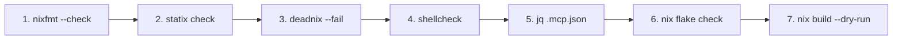

# 💻 Developer Workflows & CLI Utilities

[Back to Wiki Home](Home.md)

This page documents the repository automation utilities in `scripts/`, project initializers, and validation tools.

---

## 🧰 CLI Utilities Overview (`scripts/`)

| Script | Purpose | Usage Example |
| :--- | :--- | :--- |
| **`aft-init.sh`** | Next.js 16 Full-Stack AFT Project Initializer | `./scripts/aft-init.sh my-app` |
| **`bpt-init.sh`** | Base Polyglot Project Initializer (Python, Node, Rust, Go, Java) | `./scripts/bpt-init.sh my-api python` |
| **`adopt-repo.sh`** | External GitHub Repository Adoption CLI | `./scripts/adopt-repo.sh vercel/next.js` |
| **`validate.sh`** | 6-Step Workspace Formatting, Linting & Dry-Run Build | `./scripts/validate.sh L7V` |
| **`update.sh`** | Flake Lock Update & System Rebuild Switch | `./scripts/update.sh L7V` |
| **`age-check.sh`** | SOPS / Age Key Verification & Health Check | `./scripts/age-check.sh` |
| **`secrets-rotate.sh`** | SOPS Secret Key Re-encryption Tool | `./scripts/secrets-rotate.sh` |
| **`bootstrap.sh`** | Host SSH / Age Key Bootstrapper | `./scripts/bootstrap.sh` |

---

## 🚀 1. Agentic Framework Template (AFT) (`scripts/aft-init.sh`)

Initializes a production-grade full-stack Next.js 16 web application with React 19, TypeScript, TailwindCSS v4, and AI Agent governance guidelines.

```bash
./scripts/aft-init.sh <project-name> [target-directory]
# Example:
./scripts/aft-init.sh dashboard ~/dev/projects/company/active/dashboard
```

- Pre-configures `AGENTS.md`, `.env.example`, `package.json`, `tsconfig.json`, and `devenv.nix`.
- Sets up non-interactive initialization adhering to system guidelines.

---

## 📦 2. Base Polyglot Template (BPT) (`scripts/bpt-init.sh`)

Scaffolds a lightweight, isolated project directory configured with `devenv.nix` and `.envrc` for direnv auto-loading.

```bash
./scripts/bpt-init.sh <project-name> [python|node|rust|go|java|minimal]
# Example:
./scripts/bpt-init.sh analytics-service python
```

---

## 🔄 3. Repository Adoption (ADOPT) (`scripts/adopt-repo.sh`)

Adopts an external GitHub repository into the system workspace (`~/dev/sandboxes/playgrounds/`), performing automated security scanning and isolation setup.

```bash
./scripts/adopt-repo.sh <github-url-or-slug>
# Example:
./scripts/adopt-repo.sh expressjs/express
```

- Scans repository for unencrypted credentials / private keys.
- Generates localized `devenv.nix` environment.
- Configures `direnv allow` automatically.

---

## 🔍 4. System Validation (`scripts/validate.sh`)

Runs the fatal 6-step code quality and build verification suite:

```bash
./scripts/validate.sh [HOST]
# Default host is L7V:
./scripts/validate.sh L7V
```



Every step is fatal (`set -euo pipefail`). If any step fails, the script exits immediately with the offending tool output.
