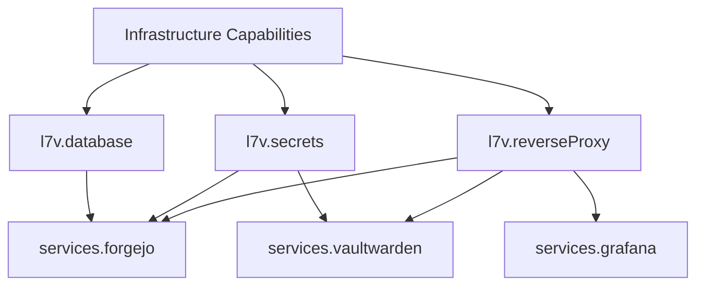

# ⚙️ Services & Infrastructure Capabilities

[Back to Wiki Home](Home.md)

This page describes the infrastructure capabilities (`capabilities/`) and managed application services (`services/`) available across workstation and server hosts.

---

## 🔌 Capabilities (`capabilities/`)

Capabilities are cross-cutting infrastructure features activated declaratively via `l7v.<capability>.enable = true`.

| Capability | Module Path | Primary Software | Key Features |
| :--- | :--- | :--- | :--- |
| **Database** | `capabilities/database/` | PostgreSQL 16 + PgBouncer + Redis | Socket authentication, PgBouncer pooler on port 6432, Redis memory cache. |
| **Backup** | `capabilities/backup/` | Restic + AWS S3 / SFTP | Offsite daily automated backups, S3 bucket/prefix resolution, age-encrypted credential injection. |
| **Logging** | `capabilities/logging/` | Grafana Loki + Fluent-bit | Centralized log aggregation on port 3100, systemd journal shipping via Fluent-bit. |
| **Metrics** | `capabilities/metrics/` | Prometheus + Node Exporter | Telemetry scraping on port 9090, system resource metrics (CPU, RAM, Disk, Network). |
| **Secrets** | `capabilities/secrets/` | `sops-nix` + Age | Encrypted secret materialization into `/run/secrets/`, Age key at `/etc/age/key`. |
| **Messaging** | `capabilities/messaging/` | Postfix + Matrix/Synapse + Ntfy | Postfix loopback relay, Matrix homeserver on port 8008, Ntfy push notifications on port 2586. |
| **Virtualisation** | `capabilities/virtualisation/` | Docker + Podman + KVM/QEMU | Container daemons, Libvirt management, rootless Podman execution. |
| **Reverse Proxy** | `capabilities/reverse-proxy/` | Nginx + Let's Encrypt ACME | Automated TLS certificates, virtual host proxying, security headers. |

---

## 🚀 Application Services (`services/`)

Application services build on top of infrastructure capabilities and require assertions (e.g. `l7v.database.enable = true`).

### 1. Forgejo (`services/forgejo/`)
- **Domain:** `git.l7v.dev`
- **Port:** `127.0.0.1:3000` (proxied by Nginx)
- **Backend:** PostgreSQL database (`forgejo`) via Unix socket auth.
- **Features:** Self-hosted Git repository forge, registration disabled by default, SOPS admin password materialization.

### 2. Vaultwarden (`services/vaultwarden/`)
- **Domain:** `vault.l7v.dev`
- **Port:** `127.0.0.1:8222` (proxied by Nginx)
- **Features:** Bitwarden-compatible lightweight password manager, WebSocket notification support on port 3012, automated SQLite database dumps to `/var/backup/vaultwarden/`.

### 3. Grafana (`services/grafana/`)
- **Domain:** `observe.l7v.dev`
- **Port:** `127.0.0.1:3000` (proxied by Nginx)
- **Features:** Pre-configured dashboards for system metrics (Prometheus) and log aggregation (Loki).

### 4. Attic Cache (`services/attic/`)
- **Domain:** `cache.l7v.dev`
- **Features:** Self-hosted high-performance Nix binary cache server for sharing compiled build artifacts across workstation and builder hosts.

---

## 📋 Service Dependency Matrix

