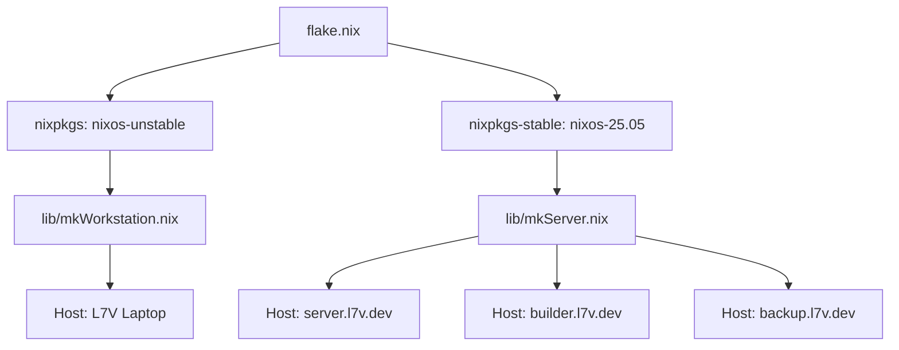

# 🏛️ System Architecture & Flake Design

[Back to Wiki Home](Home.md)

This page details the structural architecture, module hierarchy, and host construction patterns of the **L7V NixOS Infrastructure Repository**.

---

## 📐 Flake Design & Channel Strategy

The system uses a **dual-channel pinning strategy** via `flake.nix`:

- **Workstations (`L7V` / laptop):** Pin `nixos-unstable` (`nixpkgs`) to provide bleeding-edge desktop features, Wayland compositors (Niri, Hyprland), latest kernels (Zen kernel), and modern developer toolchains.
- **Servers (`server`, `builder`, `backup`):** Pin `nixos-25.05` (`nixpkgs-stable`) to guarantee long-term stability, deterministic upgrades, and enterprise-grade reliability.



---

## 🏗️ The 5 Core System Layers

All system capabilities are organized into 5 decoupled, single-responsibility layers:

```text
/home/l7v/dev/projects/company/active/nixos/
├── infrastructure/       # 1. Core OS: Boot, Network, Security, Identity, Storage
├── capabilities/         # 2. Cross-cutting infra: Database, Backup, Logging, Metrics, Secrets
├── services/             # 3. Application services: Forgejo, Vaultwarden, Grafana, Attic
├── experience/           # 4. Desktop GUI (workstation only): Niri, Hyprland, Audio, Bluetooth
└── platform/             # 5. Developer platform: CI, Deploy, FHS env, Inventory, Documentation
```

### 1. `infrastructure/` (Core System OS)
Manages fundamental Linux system infrastructure:
- **`boot/`**: `systemd-boot`, EFI variables, Zen kernel for workstations, LTS kernel for servers.
- **`network/`**: `NetworkManager` for workstations, `systemd-networkd` for headless servers.
- **`security/`**: OpenSSH hardening (password auth disabled), fail2ban, sysctl kernel hardening, custom PKI root store.
- **`identity/`**: User accounts (`l7v`), Zsh default shell, sudo rules (`nixos-rebuild NOPASSWD`).
- **`storage/`**: Btrfs subvolume layout (`root`, `nix`, `home`, `tmp`, `srv`), LUKS encryption helpers.

### 2. `capabilities/` (Cross-Cutting Infrastructure Services)
Features that provide reusable system infrastructure when `l7v.<capability>.enable = true`:
- **`database/`**: PostgreSQL cluster, PgBouncer connection pooler, Redis cache.
- **`backup/`**: Offsite Restic backups targeting AWS S3 or SFTP targets.
- **`logging/`**: Grafana Loki log aggregation + Fluent-bit log shipper.
- **`metrics/`**: Prometheus metrics collection + Node Exporter system telemetry.
- **`secrets/`**: `sops-nix` integration for Age-encrypted secrets.
- **`messaging/`**: Postfix SMTP relay, Matrix/Synapse homeserver, ntfy push notification server.
- **`virtualisation/`**: Docker daemon, Podman, KVM/QEMU, Libvirt setup.

### 3. `services/` (Application Services)
Self-hosted user applications built on top of capabilities:
- **`forgejo/`**: Self-hosted Git forge (`git.l7v.dev`) with PostgreSQL backend.
- **`vaultwarden/`**: Lightweight Bitwarden-compatible password manager (`vault.l7v.dev`).
- **`grafana/`**: Telemetry and metrics dashboard (`observe.l7v.dev`).
- **`attic/`**: High-performance self-hosted Nix binary cache server.

### 4. `experience/` (Workstation GUI Layer)
Imported **exclusively on workstations** (never on headless servers):
- **`desktop/common/`**: Shared Wayland environment variables (Ozone, Firefox Wayland, Qt/GTK backends, Bibata cursor).
- **`desktop/niri/`**: Niri scrollable tiling window manager module.
- **`desktop/hyprland/`**: Hyprland dynamic tiling window manager module.
- **`desktop/noctalia/`**: Noctalia Shell v5 status bar, launcher, control center, and OSD integration.
- **`capabilities/`**: PipeWire audio, BlueZ bluetooth, SwayNotificationCenter, Cliphist clipboard history.

### 5. `platform/` (Developer Platform & Tooling)
- **`ci/`**: Continuous integration runner configuration.
- **`deploy/`**: Colmena deployment hive integration.
- **`pkgs/qoder/`**: Custom derivation for Qoder AI IDE.
- **`fhs.nix`**: FHS compatibility environment for non-Nix binaries.

---

## 🛠️ Builder Helper Functions (`lib/`)

- **`mkWorkstation` (`lib/mkWorkstation.nix`):** Instantiates a workstation host with `nixos-unstable`, `home-manager`, Niri/Hyprland profiles, developer tools, and desktop experience modules.
- **`mkServer` (`lib/mkServer.nix`):** Instantiates a server host with `nixos-stable` (25.05), headless profile, LTS kernel, `systemd-networkd`, and role-based capability activation (`web`, `db`, `observe`, `ci`, `backup`).
